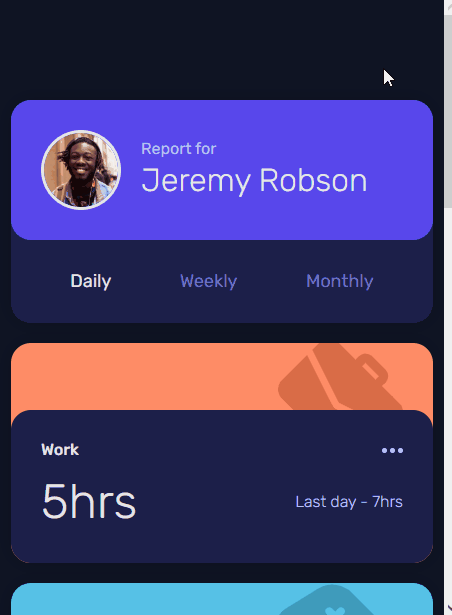

# Projeto Frontend Mentor
> Repositório destinado a resolver diversos desafios da plataforma [Frontend Mentor](https://www.frontendmentor.io/challenges).

## Sumário
- [Desafios](#desafios)
  - [News homepage](#news-homepage)
  - [Dropdown navigation](#dropdown-navigation)
  - [Notifications page](#notifications-page)
  - [Tip calculator](#tip-calculator)
  - [Testimonials grid](#testimonials-grid)
  - [Time tracking](#time-tracking)

## Desafios

### News homepage

Nível de dificuldade = **Junior** 
Essa é a solução para o desafio [News homepage challenge](https://www.frontendmentor.io/challenges/news-homepage-H6SWTa1MFl).

#### Screenshots

[Minha resolução](https://ccostafrias.github.io/projeto-fe-mentor/level-junior/news-homepage-main/index.html)

    
&nbsp; &nbsp; &nbsp; &nbsp;
       

#### Skills praticadas

- Semanticidade HTML5
- Flexbox display
- Responsividade

#### Conclusão

Um desafio bem simples, com um layout intuitivo e agradável, mas que me fez quebrar um pouco a cabeça em relação ao elementos do rodapé da página, pois não estavam se enquadrando tão bem quanto eu queria. Por fim, o resultado me agradou bastante!

### Dropdown navigation

Nível de dificuldade = **Junior** 
Essa é a solução para o desafio [Intro section with dropdown navigation](https://www.frontendmentor.io/challenges/intro-section-with-dropdown-navigation-ryaPetHE5).

#### Screenshots

[Minha resolução](https://ccostafrias.github.io/projeto-fe-mentor/level-junior/dropdown-navigation/index.html)

    
&nbsp; &nbsp; &nbsp; &nbsp;
    

#### Skills praticadas

- Flexbox display
- Grid display
- Responsividade
- Menu de navegação interativo

#### Conclusão

Outro desafio simples, mas com um resultado bem bacana. Pude explorar um pouco dos menus de navegação, até então pouco estudados por minha pessoa.

### Notifications Page

Nível de dificuldade = **Junior** 
Essa é a solução para o desafio [Notifications page](https://www.frontendmentor.io/challenges/notifications-page-DqK5QAmKbC).

#### Screenshots

[Minha resolução](https://ccostafrias.github.io/projeto-fe-mentor/level-junior/notifications-page-main/index.html)

    
&nbsp; &nbsp; &nbsp; &nbsp;
    

#### Skills praticadas

- Flexbox display
- JavaScript com DOM elements
- Form values

#### Conclusão

Um desafio com layout simples, e por isso me dei o trabalho de fazer um bônus: uma espécie de "notifications maker". No canto superior esquerdo, clique na **?** (invisível primeiramente), insira seus próprios dados e envie sua notificação, totalmente personalizada!
Gostei muito do resultado e estou pronto para o próximo já!

### Tip calculator

Nível de dificuldade = **Junior** 
Essa é a solução para o desafio [Tip calculator app](https://www.frontendmentor.io/challenges/tip-calculator-app-ugJNGbJUX).

#### Screenshots

[Minha resolução](https://ccostafrias.github.io/projeto-fe-mentor/level-junior/tip-calculator-app/index.html)

    
&nbsp; &nbsp; &nbsp; &nbsp;
    

#### Skills praticadas

- Flexbox display
- Grid display
- JavaScript com DOM elements

#### Conclusão

A parte do HTML e do CSS foram bem tranquilas, o maior trabalho foi em deixar o script em JS bem limpo e tirar a maioria dos bugs e erros possíveis.

### Testimonials grid

Nível de dificuldade = **Junior** 
Essa é a solução para o desafio [Testimonials Grid Section](https://www.frontendmentor.io/challenges/testimonials-grid-section-Nnw6J7Un7).

#### Screenshots

[Minha resolução](https://ccostafrias.github.io/projeto-fe-mentor/level-junior/testimonials-grid-section/index.html)

    
&nbsp; &nbsp; &nbsp; &nbsp;
    

#### Skills praticadas

- Semanticidade HTML5
- Grid display

#### Conclusão

Provavelmente o desafio mais fácil até agora, ou pelo menos o que levei menos tempo. Envolve alguns conhecimentos de grid, mas nada que uma aulinha rápida não sane todas as dúvidas sobre o assunto.

### Time tracking

Nível de dificuldade = **Junior** 
Essa é a solução para o desafio [Time tracking dashboard](https://www.frontendmentor.io/challenges/time-tracking-dashboard-UIQ7167Jw).

#### Screenshots

[Minha resolução](ccostafrias.github.io/projeto-fe-mentor/level-junior/time-tracking-dashboard/index.html)

    
&nbsp; &nbsp; &nbsp; &nbsp;
    

#### Skills praticadas

- Flexbox display
- Grid display
- JavaScript com DOM elements
- Arquivo JSON

#### Conclusão

Um dos resultados que mais me agradou, porém o mais frustrante. Tentei procurar como importar um arquivo JSON para então transformá-lo em um objeto, mas por ser *newbie* nesta área, fracassei miseravelmente e simplesmente colei o arquivo JSON no meu próprio scrip em JS. Contudo, esta pequena intempérie não afetou o resultado final, o qual ficou bem legal e fiél ao original.
