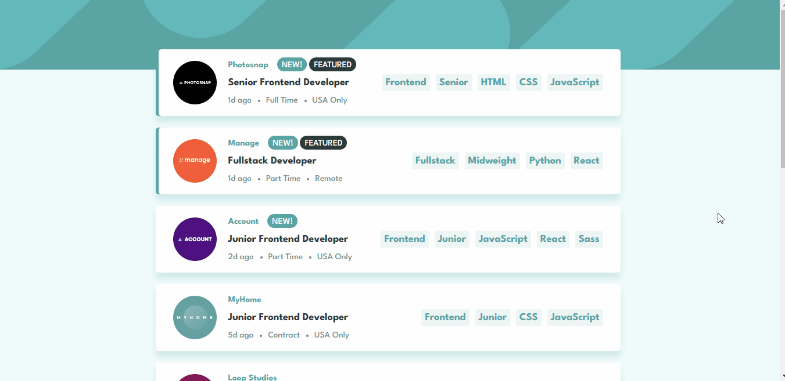

# Projeto Frontend Mentor
> Repositório destinado a resolver diversos desafios da plataforma [Frontend Mentor](https://www.frontendmentor.io/challenges).

## Sumário
- [Desafios](#desafios)
  - [News homepage](#news-homepage)
  - [Dropdown navigation](#dropdown-navigation)
  - [Notifications page](#notifications-page)
  - [Tip calculator](#tip-calculator)
  - [Testimonials grid](#testimonials-grid)
  - [Time tracking](#time-tracking)
  - [Rock paper scissors](#rock-paper-scissors)
  - [Countries API](#countries-api)
  - [Job Listings](#job-listings)
  - [IP Address Tracker](#ip-address-tracker) 

## Desafios

### News homepage

Nível de dificuldade = **Junior** 
Essa é a solução para o desafio [News homepage challenge](https://www.frontendmentor.io/challenges/news-homepage-H6SWTa1MFl).

#### Screenshots

[Minha resolução](https://ccostafrias.github.io/projeto-fe-mentor/level-junior/news-homepage-main/index.html)

    
&nbsp; &nbsp; &nbsp; &nbsp;
       

#### Skills praticadas

- Semanticidade HTML5
- Flexbox display
- Responsividade

### Dropdown navigation

Nível de dificuldade = **Junior** 
Essa é a solução para o desafio [Intro section with dropdown navigation](https://www.frontendmentor.io/challenges/intro-section-with-dropdown-navigation-ryaPetHE5).

#### Screenshots

[Minha resolução](https://ccostafrias.github.io/projeto-fe-mentor/level-junior/dropdown-navigation/index.html)

    
&nbsp; &nbsp; &nbsp; &nbsp;
    

#### Skills praticadas

- Flexbox display
- Grid display
- Responsividade
- Menu de navegação interativo

### Notifications Page

Nível de dificuldade = **Junior** 
Essa é a solução para o desafio [Notifications page](https://www.frontendmentor.io/challenges/notifications-page-DqK5QAmKbC).

#### Screenshots

[Minha resolução](https://ccostafrias.github.io/projeto-fe-mentor/level-junior/notifications-page-main/index.html)

    
&nbsp; &nbsp; &nbsp; &nbsp;
    

#### Skills praticadas

- Flexbox display
- JavaScript com DOM elements
- Form values

### Tip calculator

Nível de dificuldade = **Junior** 
Essa é a solução para o desafio [Tip calculator app](https://www.frontendmentor.io/challenges/tip-calculator-app-ugJNGbJUX).

#### Screenshots

[Minha resolução](https://ccostafrias.github.io/projeto-fe-mentor/level-junior/tip-calculator-app/index.html)

    
&nbsp; &nbsp; &nbsp; &nbsp;
    

#### Skills praticadas

- Flexbox display
- Grid display
- JavaScript com DOM elements

### Testimonials grid

Nível de dificuldade = **Junior** 
Essa é a solução para o desafio [Testimonials Grid Section](https://www.frontendmentor.io/challenges/testimonials-grid-section-Nnw6J7Un7).

#### Screenshots

[Minha resolução](https://ccostafrias.github.io/projeto-fe-mentor/level-junior/testimonials-grid-section/index.html)

    
&nbsp; &nbsp; &nbsp; &nbsp;
    

#### Skills praticadas

- Semanticidade HTML5
- Grid display

### Time tracking

Nível de dificuldade = **Junior** 
Essa é a solução para o desafio [Time tracking dashboard](https://www.frontendmentor.io/challenges/time-tracking-dashboard-UIQ7167Jw).

#### Screenshots

[Minha resolução](ccostafrias.github.io/projeto-fe-mentor/level-junior/time-tracking-dashboard/index.html)

    
&nbsp; &nbsp; &nbsp; &nbsp;
    

#### Skills praticadas

- Flexbox display
- Grid display
- JavaScript com DOM elements
- Arquivo JSON

### Rock paper scissors

Nível de dificuldade = **Avançado** 
Essa é a solução para o desafio [Rock, Paper, Scissors game](https://www.frontendmentor.io/challenges/rock-paper-scissors-game-pTgwgvgH).

#### Screenshots

[Minha resolução](https://ccostafrias.github.io/projeto-fe-mentor/level-advanced/rock-paper-scissors/index.html)

    
&nbsp; &nbsp; &nbsp; &nbsp;
    

#### Skills praticadas

- Responsividade
- Flexbox display
- Grid display
- JavaScript com DOM elements
- Arquivo JSON

### Countries API

Nível de dificuldade = **Avançado** 
Essa é a solução para o desafio [REST Countries API with color theme switcher](https://www.frontendmentor.io/challenges/rest-countries-api-with-color-theme-switcher-5cacc469fec04111f7b848ca).

#### Screenshots

[Minha resolução](https://ccostafrias.github.io/projeto-fe-mentor/level-intermediate/countries-api/)

    
&nbsp; &nbsp; &nbsp; &nbsp;
    

#### Skills praticadas

- Responsividade
- Flexbox display
- Grid display
- JavaScript com DOM elements
- Arquivo JSON
- Manipulação de Array
- Mudança de tema (dark & light)

### Job Listings

Nível de dificuldade = **Intermediário** 
Essa é a solução para o desafio [Job listings with filtering](https://www.frontendmentor.io/challenges/job-listings-with-filtering-ivstIPCt).

#### Screenshots

[Minha resolução](https://ccostafrias.github.io/projeto-fe-mentor/level-intermediate/job-listing/)

    
&nbsp; &nbsp; &nbsp; &nbsp;
    

#### Skills praticadas

- Responsividade
- Flexbox display
- JavaScript com DOM elements
- Arquivo JSON
- Manipulação de Array e Objeto

### IP Address Tracker

Nível de dificuldade = **Intermediário** 
Essa é a solução para o desafio [IP Address Tracker](https://www.frontendmentor.io/challenges/ip-address-tracker-I8-0yYAH0).

#### Screenshots

[Minha resolução](https://ccostafrias.github.io/projeto-fe-mentor/level-intermediate/ip-address-tracker-master/)

    
&nbsp; &nbsp; &nbsp; &nbsp;
    

#### Skills praticadas

- Responsividade
- Flexbox display
- JavaScript com DOM elements
- Arquivo JSON
- Manipulação de Array e Objeto
- Uso de API's
